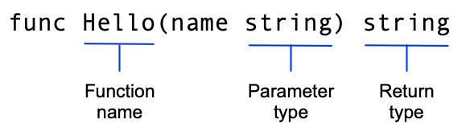

### run app
`go run .`

### packages
https://pkg.go.dev/

### adding new packages
`go mod tidy`

### Exported names
a function whose name starts with a capital letter can be called by a functioun not in the same package.

### functions
`func

### := operator
`:=` operator is a shortcut for declaring and initializing a variable. i.e.
```go
    message := "123"
```

instead of 
```go
    var message string
    message = fmt.Sprintf("Hi, %v. Welcome!", name)
```

### printers
```
If the name starts with Print, it writes to standard output
If the name starts with Fprint, it writes to an io.Writer (possibly to a file, thus the 'f')
If the name starts with Sprint, it writes to a string and returns that string
If the name ends with f, it is a formatted print, that is, it gets a format argument like "%s %d", and formats the output based on that.
If the name ends with ln like Println, it prints a newline after writing
Otherwise it simply prints its arguments using their default formats.
```

### accessing modules
`$ go mod edit -replace example.com/greetings=../greetings`


### testing
run tests:
`go test`

run tests with verbose output
`go test -v`

### build 
`$ go build`
then run `./hello`

### Go Types & Null Values
Basic Types
Go comes with a couple of built-in basic types:

int => A number WITHOUT decimal places (e.g., -5, 10, 12 etc)

float64 => A number WITH decimal places (e.g., -5.2, 10.123, 12.9 etc)

string => A text value (created via double quotes or backticks: "Hello World", `Hi everyone')

bool => true or false

But there also are some noteworthy "niche" basic types which you'll typically not need that often but which you should still know about:

uint => An unsigned integer which means a strictly non-negative integer (e.g., 0, 10, 255 etc)

int32 => A 32-bit signed integer, which is an integer with a specific range from -2,147,483,648 to 2,147,483,647 (e.g., -1234567890, 1234567890)

rune => An alias for int32, represents a Unicode code point (i.e., a single character), and is used when dealing with Unicode characters (e.g., 'a', 'ñ', '世')

uint32 => A 32-bit unsigned integer, an integer that can represent values from 0 to 4,294,967,295

int64 => A 64-bit signed integer, an integer that can represent a larger range of values, specifically from -9,223,372,036,854,775,808 to 9,223,372,036,854,775,807

There also are more types like int8 or uint8 which work in the same way (=> integer with smaller number range)

Null Values
All Go value types come with a so-called "null value" which is the value stored in a variable if no other value is explicitly set.

For example, the following int variable would have a default value of 0 (because 0 is the null value of int, int32 etc):

var age int // age is 0
Here's a list of the null values for the different types:

int => 0

float64 => 0.0

string => "" (i.e., an empty string)

bool => false

### 


### 


### 


